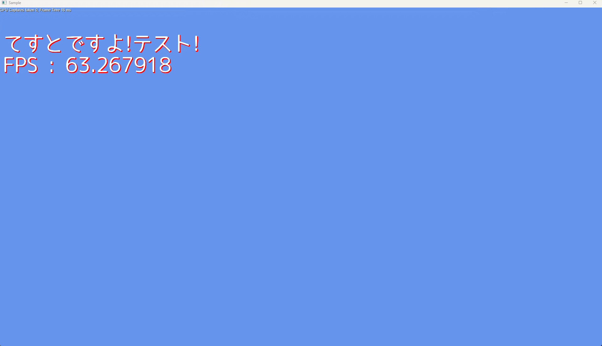

# ImGuiRingMenu

ImGuiを用いて聖剣伝説風のリングメニューを描画します.  

## 組み込み方法について
ImGuiRingMenu.cppとImGuiRingMenu.hをプロジェクトに追加してください。  

## 使用方法について
メニュー項目は第1引数にラベル名，第2引数にImTextureID型のアイコン画像を指定してください。  
実装例は次のように追加します。   

~~~~~
ImGuiRingMenu menu;
menu.Add({"Menu1", MenuIcon1});
menu.Add({"Menu2", MenuIcon2});
menu.Add({"Menu3", ImTexureID_Invalid});
~~~~~

アイコン画像がない場合は，ラベル名の1文字目をアイコン代わりに描画します。  
アニメーション更新のため，毎フレームImGuiRingMenu::Update()と，ImGuiRingMenu::Draw()を呼び出してください.  

~~~~~
// アニメーションを更新.
menu.Update(deltaSeconds);

// 描画処理.
if (menu.Draw(selectedItemIndex))
{
    // ここで，選択された項目に応じた処理を行う.
    ...
}
~~~~~

アイコンを削除したい場合は，Remove()を利用します。第1引数にメニュー項目番号を指定してください。  
終了処理などで一気にメニュー項目を削除したい場合は，Clear()を呼んでください。  
キーを操作を変更したい場合は，ImGuiRingMenu::ConfigのKeyMenuStartやKeyXXXという値を使用したキーのImGuiKey列挙体の値に変更してください。  

## ライセンスについて
[MITライセンス](LICENSE)  

